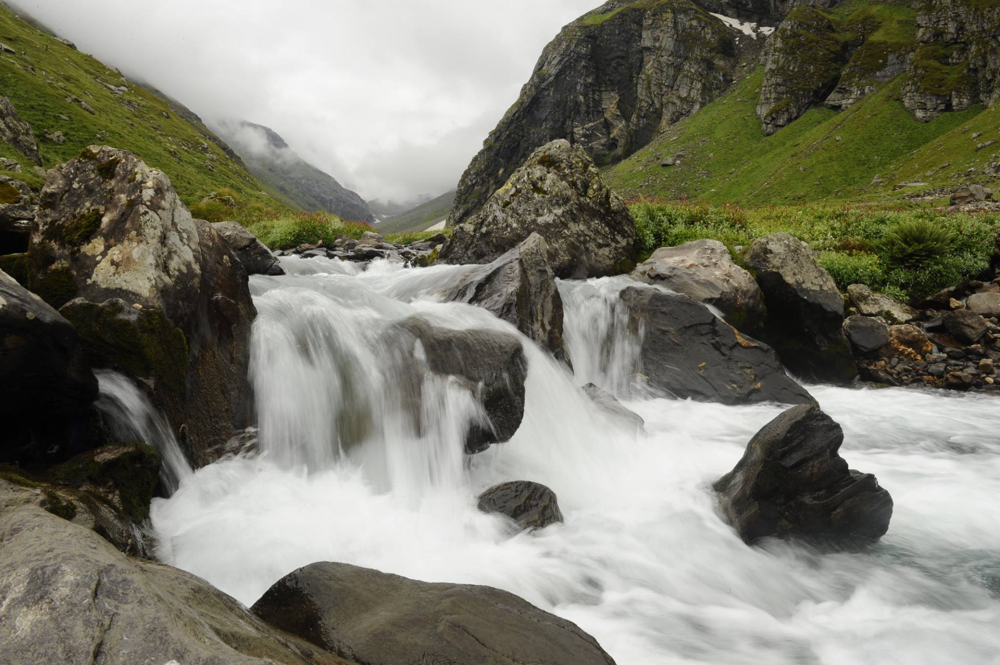

How to decide between the Hampta Pass or the Hampta Circle trek?

I would say if you are on a budget or have fewer days or this is your first high altitude trek you should choose the Hampta Circle Trek. The Hampta Circle Trek can also be done in the months of April, May and till nearly December. Whereas the Hampta Pass Trek can be done from mid June till October.

If you are not sure which trek to do, here is a quick comparison of both these treks.

### Season For Hampta Pass Vs Season For Hampta Circle
The Hampta Pass trek can be done only when the snow recedes on the pass. The trek is open from June till October. The Hampta circle trek on the other hand could be done all through the year.

### Route For Hampta Pass Vs Route For Hampta Circle
The Hampta Pass trek like the name says is a trek which goes across the pass. The trek has multiple start points but it has to eventually cross the pass and end at Chhatru.  The Hampta Circle trek on the other hand does not have a fixed route, the route depends on the guide. The trek can be customised for the number of days, distance or the maximum altitude a trekker wants to touch.
